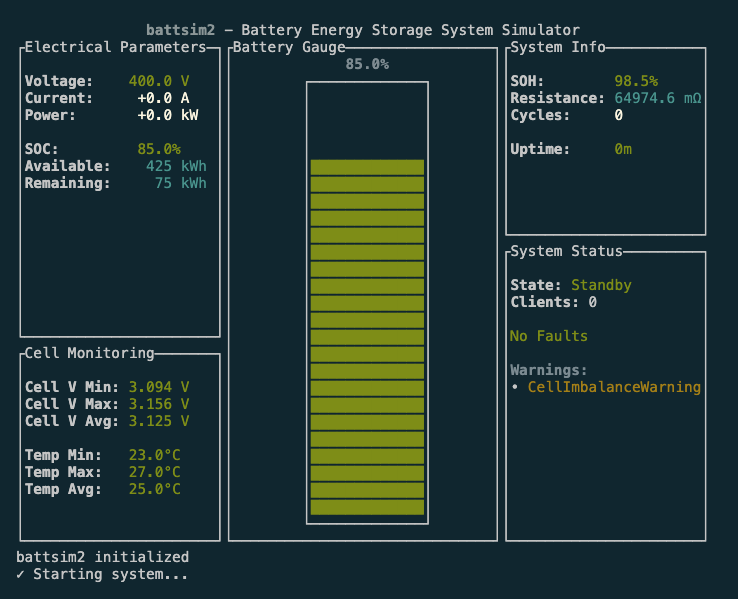

# BattSim2

A battery energy storage system simulator written in Rust, designed for learning and testing Modbus protocol interactions with battery systems.



## Overview

BattSim2 is a practical implementation project that simulates a simple energy storage system (battery) accessible via the Modbus protocol. This project serves dual purposes:
- Learning and practicing Rust programming
- Understanding battery system interactions through Modbus communication

This is the successor to the original `battsim` project written in Python in 2016.

## Features

- ✅ **Battery State Simulation**: Complete physics modeling with SOC, voltage, current, temperature ([specs/battery_specification.md](specs/battery_specification.md))
- ✅ **Modbus TCP Server**: Industrial protocol access on port 5020 ([specs/modbus_specification.md](specs/modbus_specification.md))
- ✅ **Terminal User Interface**: Real-time monitoring with visual battery gauge ([specs/terminal_ui_specification.md](specs/terminal_ui_specification.md))
- ✅ **Runtime Configuration**: Dynamic parameter adjustment via command interface
- ✅ **Realistic Behavior**: I²R losses, aging models, temperature effects
- ✅ **Comprehensive Logging**: Structured logging with hourly rotation

## Getting Started

### Prerequisites

- Rust (latest stable version)
- Cargo (included with Rust)

### Installation

```bash
git clone <repository-url>
cd battsim2
cargo build
```

### Running the Simulator

```bash
cargo run
```

## Project Structure

```
battsim2/
├── src/
│   ├── main.rs          # Main application entry point
│   ├── battery/         # Battery simulation logic
│   ├── modbus/          # Modbus protocol implementation
│   └── ui/              # Terminal user interface
├── specs/               # Technical specifications
├── logs/                # Application logs (gitignored)
└── CLAUDE.md            # Development instructions for Claude Code
```

## 📋 Technical Documentation

Comprehensive technical specifications are available in the [`specs/`](specs/) directory:

### [📖 Battery System Specification](specs/battery_specification.md)
Complete physics modeling, electrical characteristics, safety systems, and simulation algorithms. Covers LiFePO4 chemistry, aging models, internal resistance, and all system states.

### [🖥️ Terminal UI Specification](specs/terminal_ui_specification.md) 
Detailed terminal user interface design including the dynamic battery gauge, widget layouts, command system, and color coding. Includes implementation details and test validation.

### [🌐 Modbus Register Map](specs/modbus_specification.md)
Industrial-standard Modbus TCP protocol implementation with complete register mapping, data types, scaling factors, and integration examples for SCADA/PLC systems.

## Usage

### Basic Operation
1. **Start the simulator**: `cargo run`
2. **Monitor battery state**: View real-time parameters in the terminal UI
3. **Control the system**: Press `C` to enter command mode
4. **Get help**: Press `H` for comprehensive command documentation

### Runtime Configuration
Configure battery parameters while the system is stopped:
```
init soc 75          # Set SOC to 75%
init capacity 750    # Set capacity to 750 kWh
init voltage 420     # Set nominal voltage to 420V
init temp 30         # Set temperature to 30°C
```

### System Control
```
start                # Start the battery system
set power 50         # Set 50kW discharge power
stop                 # Stop the system
emergency_stop       # Immediate shutdown
```

### Modbus TCP Access
Connect to the Modbus server on port 5020:
```python
# Python example using pymodbus
from pymodbus.client.sync import ModbusTcpClient

client = ModbusTcpClient('localhost', port=5020)

# Read SOC (register 30001, scale 10.0)
soc_raw = client.read_input_registers(30001, 1).registers[0]
soc_percent = soc_raw / 10.0

# Set 100kW discharge power (registers 40002-40003)
power_scaled = int(100.0 * 10)  # Scale by 10
client.write_registers(40002, [0, power_scaled])  # [High, Low]
```

## 🔗 Quick Reference

- **Default System Parameters**: See [Battery Specification - Default Values](specs/battery_specification.md#default-configuration-values)
- **Complete Command List**: See [Terminal UI - Command Mode](specs/terminal_ui_specification.md#command-mode-interface)  
- **Modbus Register Addresses**: See [Modbus Register Map](specs/modbus_specification.md#input-registers-read-only---function-code-04)
- **System States & Faults**: See [Battery Specification - System States](specs/battery_specification.md#system-states-and-control)

## Configuration

The simulator supports runtime configuration of:
- ✅ Battery capacity (100-1000 kWh) and specifications
- ✅ Initial SOC, temperature, and aging parameters  
- ✅ Modbus server (automatic port selection 5020-5023)
- ✅ Power setpoints and operational limits
- ✅ System states and fault conditions

## Contributing

This is primarily a learning project, but suggestions and improvements are welcome through issues and pull requests.

## License

[To be determined]

## Acknowledgments

- Inspired by the original battsim project (Python, 2016)
- Built as part of learning Rust and battery system protocols